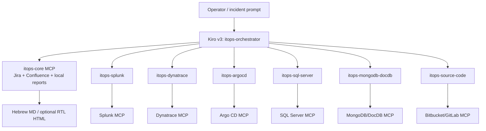

# ITOps harness design

## Architecture

Each agent embeds one stdio MCP server. This prevents workspace-global MCP inheritance from giving a specialist unrelated tools.

The launcher pins the orchestrator as the user-facing agent. Kiro subagent `availableAgents` and `trustedAgents` contain exactly the six specialist profiles, which report summaries back to the orchestrator.

The private `wiki/` tree is an auto-updated `best` knowledge-base resource on the orchestrator only. It is Git-ignored and consumed read-only. This preserves Karpathy-style immutable-source/maintained-wiki/schema separation without eagerly loading the entire knowledge base.

## Control layers

1. Vendor identity: read-only scopes/RBAC/roles.
2. MCP surface: only read tools; report/XML writes are local and path constrained.
3. Input guards: SQL/SPL/Mongo allowlists, DQL source allowlist, Argo project/app allowlists, source repository/project allowlists, safe refs, and secret-path denials.
4. Runtime bounds: timeouts, rows/documents/bytes, pool limits, TLS verification.
5. Kiro policy: tool tags, exact MCP permission matches, denied shell/fs_write/web.
6. Hook policy: v3 `PreToolUse` blocking and metadata-only `PostToolUse` audit.
7. Knowledge policy: indexed selective retrieval, provenance IDs, prompt-injection handling, and no incident-time wiki writes.

## Data handling

MCP outputs are recursively redacted and byte bounded. Audit records store timestamp, server/tool, duration, success, and an SHA-256 input hash; they do not store inputs or returned evidence.

## Failure behavior

Missing configuration, placeholders, unsafe TLS, non-read scopes, query violations, HTTP limits, and vendor errors fail closed. The report records unavailable sources rather than bypassing controls.
