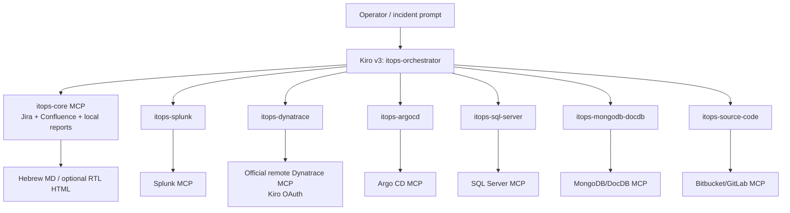

# ITOps harness design

## Architecture

Each agent declares exactly one isolated MCP server. Six are local stdio processes; Dynatrace is the official remote HTTP MCP with Kiro-managed OAuth. Workspace-global MCP inheritance remains disabled, so a specialist cannot receive unrelated tools.

The launcher pins the orchestrator as the user-facing agent. The orchestrator's Kiro v3 `permissions.rules` contain exactly the six specialist profiles, which report summaries back to the orchestrator.

The orchestrator routes routine questions and targeted checks to direct chat responses. It invokes the full investigation skill and report writer only for explicit report or comprehensive investigation/RCA/postmortem intent. Tool usage alone never changes the output mode.

The private `wiki/` tree is an auto-updated `best` knowledge-base resource on the orchestrator only. It is Git-ignored and consumed read-only. This preserves Karpathy-style immutable-source/maintained-wiki/schema separation without eagerly loading the entire knowledge base.

## Control layers

1. Vendor identity: read-only scopes/RBAC/roles; current Windows identity for Kerberos/integrated SQL; Microsoft/Entra federation only through supported SSO/OAuth flows.
2. MCP surface: only read tools; report/XML writes are local and path constrained, and report writing is prompt-gated.
3. Connection proof: every named SQL profile requests read intent and verifies its exact database is a read-only AG secondary before its isolated pool and inside each batch.
4. Input guards: explicit database connection selectors, Mongo system-database denial and per-profile database/collection allowlists, SQL/SPL query allowlists, remote Dynatrace read scopes, Argo project/app allowlists, source repository/project allowlists, exact deployed full commit SHAs, and secret-path denials.
5. Runtime bounds: timeouts, rows/documents/bytes, pool limits, TLS verification.
6. Kiro policy: v3 tool tags, exact inline subagent/MCP permission rules, and denied shell/fs_write/web.
7. Hook policy: deterministic v3 `SessionStart` context, v3 `PreToolUse` blocking, and metadata-only `PostToolUse` audit.
8. Knowledge policy: indexed selective retrieval, provenance IDs, prompt-injection handling, and no incident-time wiki writes.

## Data handling

MCP outputs are recursively redacted and byte bounded. Audit records store timestamp, server/tool, duration, success, and an SHA-256 input hash; they do not store inputs or returned evidence.

## Failure behavior

Missing/ambiguous connection selection, missing configuration, placeholders, unsafe TLS, non-read scopes, query violations, HTTP limits, and vendor errors fail closed. The report records unavailable sources rather than bypassing controls.

The Splunk dashboard generator exposes a flat `panelsJson` string in its public MCP schema. The report writer likewise accepts a flat `reportJson` string. Each server parses the JSON and validates the complete typed object internally. This avoids model-provider function-schema nesting rejection without weakening dashboard or incident-report validation.
