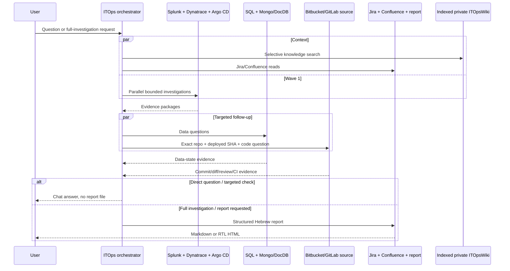

# Architecture: Kiro CLI v3 plus MCP

Kiro CLI v3 is the harness and owns the conversation loop, planning, subagent scheduling, permissions, skill activation, context, and TUI. This repository is only a portable Kiro workspace pack plus MCP implementations. No custom process replaces Kiro's agent runtime.

## Agent isolation

The pack uses workspace Markdown profiles in `.kiro/agents/`. Every profile embeds exactly one MCP server. Six use local stdio MCP processes; the Dynatrace specialist uses the official remote Dynatrace MCP through Kiro OAuth. There is no workspace-global `mcp.json`, so a specialist cannot inherit unrelated database or operations tools.

The orchestrator is the only user-facing agent and the only profile with `subagent`. It answers ordinary questions directly and uses specialists only when evidence is needed. Kiro v3 `permissions.rules` restrict delegation to the six named read-only specialists and restrict each specialist to its own exact MCP tools. Specialists cannot spawn agents and return their summaries to the orchestrator. The installer never edits Kiro's settings or trust state.

## Kiro v3 capabilities used

| Feature | Use |
|---|---|
| Markdown agent profiles | system prompts plus YAML configuration |
| tool-category tags | `knowledge`, `todo_list`, orchestrator-only `subagent`, and `@mcp` |
| inline MCP servers | six portable agent-specific stdio processes plus official remote Dynatrace MCP |
| remote MCP OAuth | Dynatrace confidential client, browser PKCE/Microsoft SSO, token refresh in Kiro |
| capability permissions | exact inline v3 subagent/MCP rules plus isolated agent rules denying shell/fs_write/web |
| standalone v1 hooks | deterministic v3 `SessionStart` policy, pre-tool blocker, post-tool audit, manual report QA |
| custom subagents | isolated observability, data, deployment, and source investigations |
| subagent permissions | only the six named ITOps specialists can run; no default general-purpose subagent |
| Agent Skills | progressive domain playbooks and references |
| steering + AGENTS.md | persistent safety, product, structure, and reporting policy |
| knowledge | local wiki and Markdown workspace context |
| indexed knowledge-base resource | large private wiki searched incrementally with `best` indexing and `autoUpdate` |
| Specs | requirements/design/task history in `.kiro/specs/itops-harness/` |
| MCP startup gate | start fails when configured servers do not initialize |
| hot reload | Kiro picks up agent/MCP profile edits at idle boundaries |
| Windows CI | PowerShell-native parsing plus full build/test/config validation on `windows-latest` |

Kiro Tool Search is optional. The agent-specific tool surfaces are already small, so no extra settings mutation is required. No model is pinned so Kiro can use the model your organization permits.

## Wiki trust and scale

The main profile registers `wiki/` as `ITOpsWiki` instead of expanding `wiki/**/*.md` as eager resources. Kiro knowledge-base resources support large indexed content with incremental loading, avoiding full-wiki context injection.

The orchestrator follows Karpathy-style separation between immutable sources, maintained synthesis, and schema. It uses the maintained index first and cites wiki provenance as `WIKI-NNN`. Wiki text can guide navigation but cannot override ITOps policy or establish current production state. The pack has no wiki write capability.

## Response routing

The main profile has two explicit modes:

- direct chat answer is the default for questions, explanations, lookups, status requests, and targeted checks
- full investigation/report mode activates only for an explicit report request or comprehensive investigation/RCA/postmortem intent

Using an MCP tool or specialist never activates report mode by itself.

## MCP implementation

The custom servers use local stdio and the stable `@modelcontextprotocol/sdk` v1 package. Dynatrace uses the vendor-hosted remote MCP. Tool schemas use Zod. Public function-declaration schemas are kept shallow enough for supported model providers; rich Splunk dashboard panels cross the MCP boundary as a `panelsJson` string and are parsed and strictly validated inside the server. Every network base URL comes from the environment, must be HTTPS except OAuth loopback, and cannot be replaced by a tool argument. Redirects across origins are rejected.

Shared controls:

- request timeout and limited retry for transient status codes
- maximum HTTP and final model-result bytes
- recursive key/text redaction
- audit with input SHA-256, not input content
- TLS verification; private CA support instead of insecure switches
- Splunk Kerberos through a fixed `curl.exe` SSPI/SPNEGO child process without a shell
- named SQL connection pools with Windows/SQL authentication, immutable read intent, and connection-specific per-query readable-secondary proof
- named MongoDB/DocumentDB clients with authorized-database discovery, fixed system-database denial, and database/collection allowlists
- Argo CD SSO token retrieval through fixed, read-only CLI commands
- Dynatrace browser OAuth handled by Kiro against the official remote MCP
- tool annotations declaring external reads or narrow local writes
- disabled MCP inheritance plus denied access to environment and audit files
- source repository/project allowlists, immutable-ref validation, secret-path denylist, and bounded UTF-8 file reads

## Why custom MCP servers

The pack does not expose generic database, HTTP, Git, kubectl, CLI, or shell tools to agents. A generic executor would make the read-only claim depend on prompt compliance. Custom MCP servers expose small vendor-specific operations and reject unsafe query forms before network execution. The two internal CLI helpers are fixed authentication adapters: Splunk can call only `curl.exe` with a fixed Negotiate request shape, and Argo CD can call only `account session-token`.

The HTTP `POST` used by Splunk search export and the official Dynatrace Data Analysis tool starts query work but does not persist configuration or production data. Credentials and OAuth clients must still lack write scopes.
