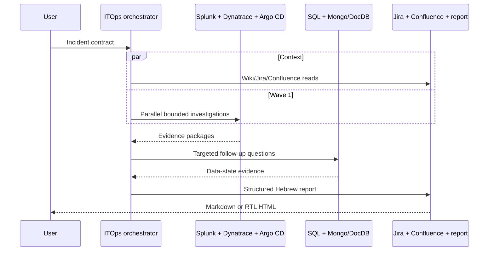

# Architecture and Kiro v3 feature use

## Agent isolation

The harness uses workspace Markdown profiles in `.kiro/agents/`. Every profile embeds exactly one MCP server. There is no workspace-global `mcp.json`, so a specialist cannot inherit unrelated database or operations tools.

The orchestrator is the only agent with `subagent`. Its permission matches only the five named specialists. Specialists cannot spawn agents.

## Kiro v3 capabilities used

| Feature | Use |
|---|---|
| Markdown agent profiles | system prompts plus YAML configuration |
| tool-category tags | `knowledge`, `todo_list`, orchestrator-only `subagent`, and `@mcp` |
| inline MCP servers | portable agent-specific stdio processes |
| capability permissions | exact MCP tool matches and denied shell/fs_write/web |
| standalone v1 hooks | session policy, pre-tool blocker, post-tool audit, manual report QA |
| custom subagents | isolated parallel observability investigations |
| Agent Skills | progressive domain playbooks and references |
| steering + AGENTS.md | persistent safety, product, structure, and reporting policy |
| knowledge | local wiki and Markdown workspace context |
| Specs | requirements/design/task history in `.kiro/specs/itops-harness/` |
| MCP startup gate | start fails when configured servers do not initialize |
| hot reload | Kiro picks up agent/MCP profile edits at idle boundaries |

Kiro Tool Search is optional. The installer can enable it, but the agent-specific tool surfaces are already small. No model is pinned so the harness can use the model your Kiro organization permits.

## MCP implementation

All servers use local stdio and the stable `@modelcontextprotocol/sdk` v1 package. Tool schemas use Zod. Every network base URL comes from the environment, must be HTTPS except localhost, and cannot be replaced by a tool argument. Redirects across origins are rejected.

Shared controls:

- request timeout and limited retry for transient status codes
- maximum HTTP and final model-result bytes
- recursive key/text redaction
- audit with input SHA-256, not input content
- TLS verification; private CA support instead of insecure switches
- tool annotations declaring external reads or narrow local writes
- disabled MCP inheritance plus denied access to environment and audit files

## Why custom MCP servers

The harness does not use generic database, HTTP, kubectl, CLI, or shell MCP servers. A generic executor would make the read-only claim depend on prompt compliance. These MCP servers expose small vendor-specific operations and reject unsafe query forms before network execution.

The HTTP `POST` used by Splunk search export and Dynatrace DQL starts query work but does not persist configuration or production data. Credentials must still lack write scopes.
